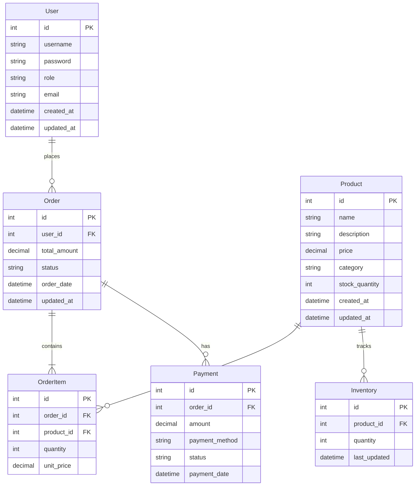

# Quick Commerce - Entity Relationship Diagram

## Entity Descriptions

### User
- Represents users in the system
- Contains authentication and authorization information
- Has a role (USER/ADMIN)

### Product
- Represents items in the product catalog
- Contains product details and pricing information
- Linked to inventory for stock management

### Order
- Represents customer orders
- Contains order status and total amount
- Linked to user who placed the order

### OrderItem
- Represents individual items within an order
- Links products to orders with quantity information

### Inventory
- Tracks product stock levels
- Updated when orders are placed or stock is modified

### Payment
- Records payment transactions
- Linked to orders and contains payment status

## Relationships

1. **User - Order**: One-to-Many
   - A user can place multiple orders
   - Each order belongs to one user

2. **Product - OrderItem**: One-to-Many
   - A product can appear in multiple order items
   - Each order item references one product

3. **Order - OrderItem**: One-to-Many
   - An order can contain multiple order items
   - Each order item belongs to one order

4. **Product - Inventory**: One-to-One
   - Each product has one inventory record
   - Each inventory record belongs to one product

5. **Order - Payment**: One-to-Many
   - An order can have multiple payment attempts
   - Each payment belongs to one order

## Notes

- All entities include audit fields (created_at, updated_at) for tracking changes
- Foreign keys are used to maintain referential integrity
- The diagram represents the core entities and their relationships
- Each service (Login, Product, Order, Payment, Inventory) manages its own subset of these entities 