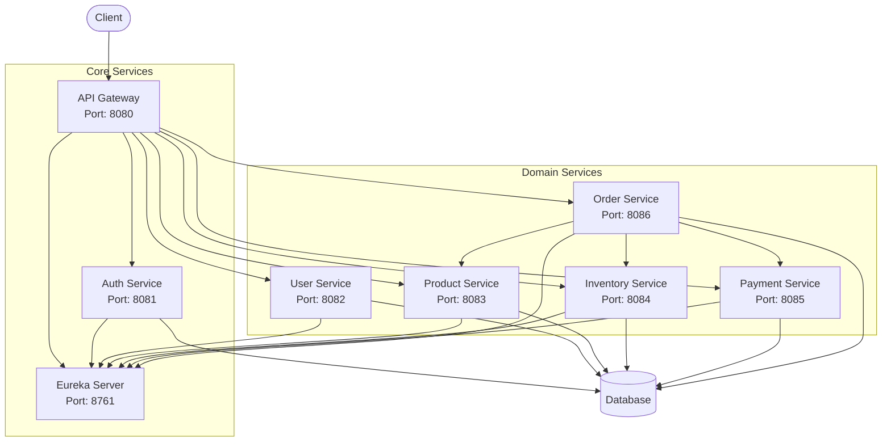
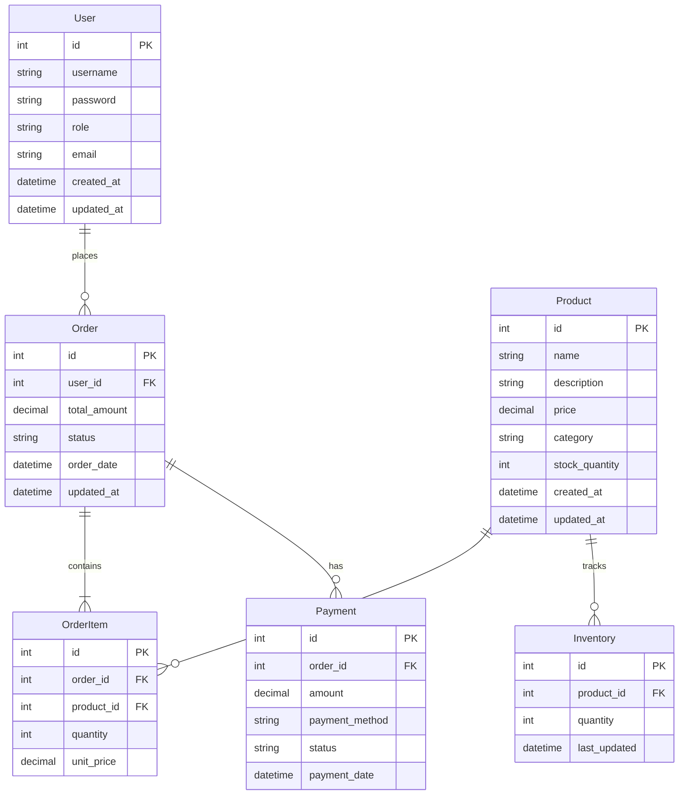

# QuickMart - Microservices E-commerce Platform

QuickMart is a robust, scalable e-commerce platform built using a microservices architecture. This project demonstrates modern application design principles with features like service discovery, API gateway, containerization, and Kubernetes orchestration.

## Architecture Diagram



## Microservices Overview

1. **API Gateway** (Port: 8080)
   - Entry point for all client requests
   - Routes traffic to appropriate microservices
   - Handles authentication and authorization
   - Provides Swagger UI at http://localhost:8080/swagger-ui.html

2. **Eureka Server** (Port: 8761)
   - Service discovery and registration
   - Load balancing
   - Health monitoring
   - Dashboard available at http://localhost:8761

3. **Auth Service** (Port: 8081)
   - User authentication and authorization
   - JWT token generation and validation
   - Role-based access control (USER/ADMIN)
   - Swagger UI: http://localhost:8081/swagger-ui.html

4. **User Service** (Port: 8082)
   - User profile management
   - User registration and updates
   - User preferences
   - Swagger UI: http://localhost:8082/swagger-ui.html

5. **Product Service** (Port: 8083)
   - Product catalog management
   - Product search and filtering
   - Category management
   - Swagger UI: http://localhost:8083/swagger-ui.html

6. **Inventory Service** (Port: 8084)
   - Stock management
   - Inventory tracking
   - Restock notifications
   - Swagger UI: http://localhost:8084/swagger-ui.html

7. **Payment Service** (Port: 8085)
   - Payment processing
   - Multiple payment methods
   - Transaction management
   - Swagger UI: http://localhost:8085/swagger-ui.html

8. **Order Service** (Port: 8086)
   - Order processing and management
   - Order status tracking
   - Integration with inventory and payment
   - Swagger UI: http://localhost:8086/swagger-ui.html

## Technical Stack

- **Framework**: Spring Boot 3.x, Spring Cloud 2023.x
- **Database**: MySQL 8.0
- **Service Discovery**: Netflix Eureka
- **API Gateway**: Spring Cloud Gateway
- **Documentation**: SpringDoc OpenAPI (Swagger)
- **Authentication**: JWT (JSON Web Tokens)
- **Container**: Docker
- **Orchestration**: Kubernetes
- **Build Tool**: Maven

## Database Schema

The application uses a relational database with the following main entities:



## Setup Instructions

### Prerequisites
- JDK 17+
- Maven 3.6+
- Docker and Docker Compose
- Kubernetes (optional, for K8s deployment)

### Local Development Setup

1. **Clone the repository**
   ```bash
   git clone https://github.com/yourusername/quickmart-backend.git
   cd quickmart-backend
   ```

2. **Run with Docker Compose**
   ```bash
   docker-compose up -d
   ```
   This will start all services and a MySQL database.

3. **Build all services (alternative)**
   ```bash
   ./build-all.bat  # For Windows
   # OR
   ./build-all.sh   # For Linux/Mac
   ```

4. **Start individual services (alternative)**
   ```bash
   # Start in this order:
   cd Eureka-Server
   mvn spring-boot:run

   cd ../API-Gateway
   mvn spring-boot:run

   # Start other services similarly
   ```

### Kubernetes Deployment

1. **Build Docker images**
   ```bash
   docker-compose build
   ```

2. **Apply Kubernetes configurations**
   ```bash
   kubectl apply -f k8s/
   ```

3. **Access services**
   ```bash
   # Forward API Gateway port
   kubectl port-forward svc/api-gateway 8080:8080
   ```

## API Documentation

Each service provides its own Swagger UI for API documentation:

1. **API Gateway**: http://localhost:8080/swagger-ui.html
2. **Auth Service**: http://localhost:8081/swagger-ui.html
3. **User Service**: http://localhost:8082/swagger-ui.html
4. **Product Service**: http://localhost:8083/swagger-ui.html
5. **Inventory Service**: http://localhost:8084/swagger-ui.html
6. **Payment Service**: http://localhost:8085/swagger-ui.html
7. **Order Service**: http://localhost:8086/swagger-ui.html

## Security

- **Authentication**: JWT-based token authentication
- **Authorization**: Role-based access control (USER/ADMIN)
- **API Security**: HTTPS, CORS configuration, CSRF protection
- **Password Security**: BCrypt password encoding

## Communication Patterns

- **Synchronous**: REST API calls between services
- **Service Discovery**: All services register with Eureka
- **API Gateway**: Central entry point for all client requests
- **Circuit Breaking**: Resilience4j for fault tolerance

## CI/CD Pipeline

The project includes a GitHub Actions workflow for continuous integration and deployment:

1. **Build and Test**
   - Triggered on push to main branch and pull requests
   - Builds all services using Maven
   - Runs unit tests and integration tests
   - Performs code quality checks with SonarQube

2. **Docker Image Build**
   - Builds Docker images for all services
   - Pushes images to Docker Hub/Container Registry
   - Tags images with commit SHA and 'latest'

3. **Kubernetes Deployment**
   - Deploys to development environment on successful build
   - Deploys to production after manual approval
   - Uses Helm charts for deployment configuration
   - Implements blue-green deployment strategy

4. **Monitoring and Rollback**
   - Monitors deployment health
   - Automatic rollback on failed deployments
   - Slack notifications for build and deployment status

## Circuit Breaker Implementation

The system implements circuit breakers using Resilience4j for fault tolerance:

1. **Configuration**
   ```yaml
   resilience4j:
     circuitbreaker:
       instances:
         default:
           failure-rate-threshold: 50
           minimum-number-of-calls: 10
           sliding-window-size: 100
           sliding-window-type: COUNT_BASED
           wait-duration-in-open-state: 5000
   ```

2. **Features**
   - Automatic circuit breaker for all service-to-service calls
   - Fallback methods for graceful degradation
   - Monitoring through Actuator endpoints
   - Configurable thresholds and timeouts

3. **Usage Example**
   ```java
   @CircuitBreaker(name = "inventoryService", fallbackMethod = "getInventoryFallback")
   public Inventory getInventory(Long productId) {
       // Service call implementation
   }

   private Inventory getInventoryFallback(Long productId, Exception e) {
       // Fallback implementation
   }
   ```

4. **Monitoring**
   - Circuit breaker states visible in Actuator endpoints
   - Metrics exported to Prometheus
   - Grafana dashboards for visualization
   - Alerting on circuit breaker state changes

## Deployment Options

1. **Docker**: Use `docker-compose.yml` for local deployment
2. **Kubernetes**: Use configurations in `k8s/` directory
3. **Standalone**: Run each service individually with Maven

## Monitoring and Observability

- Eureka Dashboard: http://localhost:8761
- Actuator endpoints for each service
- Health metrics at `/actuator/health`
- Custom metrics for business operations

## Contributing

1. Fork the repository
2. Create a feature branch
3. Implement changes with tests
4. Submit a pull request

## License

This project is licensed under the MIT License